# Architecture

Trustvian is a single-module, single-tenant Go engine built as a
hexagonal core (`event` + `internal/*`) wrapped by a thin composition
root (`Engine`, root package) and two adapters (`cmd/trustvian`,
`internal/otel`). This document explains the system's shape; see
[DOMAIN.md](DOMAIN.md) for what each pipeline stage's data actually
means, [SECURITY.md](SECURITY.md) for the threat model, and
[PERFORMANCE.md](PERFORMANCE.md) for measured hot-path behavior.
Significant decisions behind this shape are recorded as ADRs in
[`adr/`](adr/). What's planned to change this shape next — and in what
order — is in [ROADMAP.md](ROADMAP.md) and [`tasks/`](tasks/).

## System diagram

```mermaid
flowchart LR
    subgraph ext["External"]
        OTelSDK["Application / OTel SDK / Collector"]
        JSONFile["JSON file"]
    end

    subgraph adapters["Adapters (internal/, or in-module)"]
        OTelAdapter["internal/otel\n(EventFromSpan)"]
        CLI["cmd/trustvian\n(analyze, baseline build)"]
    end

    subgraph core["Core (event + internal/*) — zero infrastructure deps"]
        Event["event.Event"]
        Features["internal/features"]
        Fingerprint["internal/fingerprint"]
        Baseline["internal/baseline\n+ internal/store"]
        Anomaly["internal/anomaly"]
        Trust["internal/trust"]
        Policy["internal/policy"]
    end

    Engine["Engine (root package)\ncomposition root"]

    OTelSDK -->|span| OTelAdapter
    JSONFile -->|JSON| CLI
    OTelAdapter -->|Event| Event
    CLI -->|Event| Event
    Event --> Features --> Fingerprint --> Baseline --> Anomaly --> Trust --> Policy
    Policy -->|Decision| Engine
    Engine -.wires.-> Event
    Engine -.wires.-> Baseline
    Engine -.wires.-> Policy
    Engine -->|Result| Consumer["Caller: CLI output, future export/Control"]
```



Dotted edges are composition (`Engine` constructs and holds these), not
data flow. Nothing under `core` imports `adapters`, `Engine`, or each
other except strictly downward along the pipeline — see
[Dependency direction](#dependency-direction).

## The pipeline

Every event flows through the same seven stages, in the same order:

```
Event → Features → Fingerprint → Baseline(read) → Anomaly → Trust → Policy → Decision
                                       ↑
                              Baseline(write) via explicit Observe()
```

| Stage | Package | Input → Output |
|---|---|---|
| Features | `internal/features` | `event.Event` → `Features` (stable + volatile dimensions) |
| Fingerprint | `internal/fingerprint` | `Features.Stable` → a deterministic `Fingerprint.ID` |
| Baseline | `internal/baseline`, `internal/store` | statistical history per `(ActorID, Environment, Fingerprint)` |
| Anomaly | `internal/anomaly` | `Features` + `Baseline` → `Anomaly{Score, Confidence, Contributors}` |
| Trust | `internal/trust` | `Anomaly` + identity + context → `Trust{Score, Risk}` |
| Policy | `internal/policy` | `Trust` + `Features.Stable` → `Decision` + `Explanation` |

`Engine` (the root `trustvian` package) is the composition root that
wires all of this together — see [`engine.go`](../engine.go).

[Task 001](archive/tasks/v0.1/001-feature-model.md) added `event.Target.Category`
and `features.StableFeatures.TargetCategory` — a new field on existing
types, not a new package or dependency edge, so no change to the
pipeline shape or [dependency direction](#dependency-direction) below.

**A human, a service, and an AI agent are all just `Actor.Type` values
flowing into the exact same pipeline above** — never a second
pipeline. `ActorTypeAIAgent` (`v0.1`) and, since `v0.7` ([task
014](archive/tasks/v0.7/014-ai-agent.md), [ADR
0014](adr/0014-ai-agents-as-first-class-behavioral-actors.md)),
`event.Context`'s `SessionID`/`DelegatedFrom`/`ApprovalStatus` fields
are additive `Event`/`Context` fields, not a parallel `AgentEngine`,
`AgentAnomalyEngine`, or agent-specific `Fingerprint`/`Baseline`/
`Anomaly` type. An AI agent's tool-call sequence is scored by the
identical `internal/anomaly` signals (including every `v0.6` sequence
signal) any other actor's operation sequence would be — proven, not
merely asserted, by `TestAnalyzeAgentToolSequenceNoveltyDetectedByExistingEngine`
in [`engine_test.go`](../engine_test.go). Task
[030](archive/tasks/v0.7/030-approval-aware-policy-semantics.md) and
[031](archive/tasks/v0.7/031-delegation-behavioral-semantics.md) hold the identical
line: approval-aware policy is one more `policy.Condition` field, and
delegation novelty is one more bounded map on `Baseline`
(`DelegatorCounts`, alongside `PredecessorCounts`/`TrigramCounts`) and
one more opt-in `internal/anomaly` signal — never a second
engine, a `DelegationGraph`, or an `ApprovalPolicyEngine`. See [ADR
0015](adr/0015-approval-as-policy-evidence-not-behavioral-anomaly.md)
and [ADR
0016](adr/0016-delegation-as-behavioral-evidence-not-provenance.md).

Every stage but `Baseline` is a pure function. `Baseline` is
immutable-value-with-copy-on-write: `Baseline.Observe(...)` never
mutates its receiver, it returns a new `Baseline`. Concurrency-safe
storage of "the current `Baseline` for this key" is `internal/store`'s
job — it shards a lock per `(ActorID, Environment)` key so unrelated
actors never contend with each other.

## Analyze is read-only; Observe is the only write path

```go
result, err := engine.Analyze(ctx, ev)   // never touches the Baseline
learned, err := engine.Observe(ctx, result) // conditionally learns
```

`Observe` decides for itself whether `result` is safe to learn from —
see [Go SDK Guide § Observe and learning](sdk-guide.md#observe-and-learning)
and [Policy Guide § fail-closed, not fail-open](policy-guide.md#fail-closed-not-fail-open).
Callers never need to check `result.Decision` themselves before calling
`Observe`; it's always safe to call unconditionally.

## Cold start: two numbers, not one

A brand-new `Fingerprint` (an actor doing something Trustvian has never
seen it do before) scores as maximally novel —
`Anomaly.Score` near 1 — but with `Anomaly.Confidence` at 0.
`internal/anomaly` deliberately does not suppress `Score` for a novel
fingerprint: collapsing "how different is this" and "how much should
you trust that reading" into a single number would throw away
information a security decision needs.

The two are recombined in `internal/trust`:

```
effectiveAnomaly = Anomaly.Score * Anomaly.Confidence
TrustScore        = IdentityConfidence * (1 - effectiveAnomaly) * (1 - ContextRisk)
```

At `Confidence = 0`, `effectiveAnomaly` is 0 regardless of how novel the
event looks, so `TrustScore` falls back to identity and context alone.
This is why a first-ever, high-identity-confidence event doesn't get
blocked just for being new — see the walkthrough in
[Use Cases](use-cases.md) and the SDK example in
[Go SDK Guide § baseline maturity](sdk-guide.md#watching-trust-mature).

## Package boundaries

Four packages are importable from outside this module: the root
`trustvian` package, `event`, `alert` (`v0.4.0`), and `config`
(`v0.5`, [task 019](archive/tasks/v0.5/019-policy-config-model.md)). Everything
else lives under `internal/`, which Go's compiler enforces.

```
trustvian/
├── trustvian.go, engine.go, options.go, result.go   # public: Engine, Option, Result
├── event/                                              # public: Event, Actor, Operation, Target, Context
├── alert/                                              # public: Alert, Severity, Condition/Rule/Evaluate, Sink, WebhookSink
├── config/                                             # public: PolicyConfig/Rule/Condition, CompilePolicy
├── cmd/trustvian/                                       # CLI (in-module, can import internal/*)
├── examples/                                           # separate module: genuinely-external-consumer demos
├── processor/                                          # separate module: standalone OTel Collector processor
└── internal/
    ├── features/    fingerprint/    baseline/    store/
    ├── anomaly/     trust/          policy/
    └── otel/                                            # the ONLY package that imports go.opentelemetry.io/otel*
```

**Why `event`/`alert`/`config` sit outside `internal/`, while
`Decision`/`Policy`/most `Config` types stay under it.** Go's
`internal/` restriction only blocks *importing* a package — it does
not block reading exported fields off a value you already have, or
receiving and forwarding a value of that type via type inference
without ever spelling out its type name. `result.Trust.Score` and
`result.Decision == "block"` both work fine from external code
without importing anything beyond the root package, and (verified
empirically — see [ADR 0008](adr/0008-policy-config-boundary.md)) so
does receiving a `policy.Policy` from an exported function and passing
it straight into `trustvian.WithPolicy`. So the types that must move
out are only the ones an external caller must *construct by name* —
declare a variable of that type, or implement an interface using it in
a method signature:

- `event.Event` — the one type every caller must construct just to
  call `Engine.Analyze` at all.
- `alert.Alert`/`alert.Sink` — a third-party `Sink` implementation
  must name `Alert` in its own method signature to implement the
  interface at all; no amount of pass-through helps here, since
  *implementing* an interface (not just calling a function) requires
  naming the type (see [ADR 0007](adr/0007-alert-package-is-public.md)).
- `config.PolicyConfig`/`PolicyRule`/`PolicyCondition` — an external
  caller must construct one (by hand, or via `config.LoadFile`) to
  express custom policy behavior at all.
- `config.AnomalyConfig` (`v0.7` task 033) — the identical pattern,
  one stage earlier in the pipeline: an external caller constructs
  this to configure behavioral scoring, never
  `internal/anomaly.Config` directly.
- `config.StorageConfig` (`v0.8` task 034) — the same pattern again,
  for persistence. `store.Store` is the one case where pass-through
  alone was *not* enough even in principle: it is an interface whose
  methods reference internal types, so an external caller could neither
  name it nor implement it, and before task 034 no exported function
  returned one. `WithStore` was therefore in-module-only in practice,
  silently pinning every external deployment to the in-memory default.
  Task 035 added `PostgresStorageConfig` to the same document, so
  selecting a production database is a YAML edit rather than a new
  mechanism. See [ADR
  0018](adr/0018-production-store-boundary-and-postgresql-direction.md).

`policy.Policy`/`Condition`/`Rule`/`Decision`, `anomaly.Config`,
`trust.Config`, and `store.Store` implementations all stay
`internal/`: no external caller needs to *construct* any of them by
name. `config.CompilePolicy`/`config.CompileAnomaly` are the two
exported functions that produce a `policy.Policy`/`anomaly.Config` for
pass-through use — the identical boundary [ADR
0008](adr/0008-policy-config-boundary.md) established for Policy in
`v0.5`, extended to Anomaly configuration by [ADR
0017](adr/0017-public-anomaly-configuration-boundary.md) in `v0.7`:

```text
config.PolicyConfig  → CompilePolicy  → policy.Policy   → Engine
config.AnomalyConfig → CompileAnomaly → anomaly.Config   → Engine
config.StorageConfig → CompileStorage → store.Store      → Engine
```

`CompileStorage` is the one of the three that is deliberately *not*
pure — it opens the store, so a load failure surfaces at construction
rather than on the first `Observe`. All three fail closed; for storage
that specifically means a nil `Store` on any error, never a silent
downgrade to non-durable storage.

`trust.Config` is the one config type this pattern has not yet reached
— see [Go SDK Guide § the public/internal boundary
today](sdk-guide.md#configuring-from-outside-the-module) and the
[Roadmap](ROADMAP.md) for the current state.

**Why `internal/otel` is the only package that imports OpenTelemetry.**
The core engine (`event` through `internal/policy`, and `Engine`
itself) has zero OpenTelemetry dependency. The OTel Collector
processor ([`processor/`](../processor/), `v0.2`) is implemented as a
separate module — it needs the heavier `otelcol-builder`-adjacent
toolchain — so that dependency tree never touches the core engine's;
`go list -deps` on this module's own root confirms `processor/`'s
existence changes nothing here.

## Dependency direction

Verified directly, not asserted — `go list -deps` on every package:

```
event            → (stdlib only)
internal/features    → event
internal/fingerprint → internal/features
internal/baseline    → internal/features, internal/fingerprint
internal/store       → internal/baseline, internal/features, internal/fingerprint
internal/anomaly     → internal/baseline, internal/features, internal/fingerprint
internal/trust       → internal/anomaly
internal/policy      → event, internal/features, internal/trust
internal/otel        → event, internal/features   (+ go.opentelemetry.io/otel*)
trustvian (root)     → event, internal/{anomaly,baseline,features,fingerprint,policy,store,trust}
cmd/trustvian        → trustvian (root), event, internal/policy, internal/trust
```

Every edge points strictly toward an earlier pipeline stage or a leaf
(`event`). Nothing under `internal/` imports the root package or
`cmd/`, so there is no cycle: `internal/otel` is the only package with
an external (non-stdlib) import, and the root package + `cmd/trustvian`
are the only ones that assemble the pipeline stages together.

## Storage boundary

`internal/store.Store` is the only seam between the pipeline and how
`Baseline` data is held:

```go
type Store interface {
	Get(ctx context.Context, key baseline.Key) (baseline.Baseline, bool)
	Observe(ctx context.Context, key baseline.Key, fp fingerprint.Fingerprint, vol features.VolatileFeatures, now time.Time) (baseline.Baseline, error)
}
```

Two methods, matching `Baseline`'s actual access pattern exactly — not
a generic repository. Three implementations exist:

- `store.InMemory` — baselines do not survive a process restart. Still
  the default.
- `store.FileStore` — a JSON file on disk, flushed synchronously after
  every `Observe`; baselines survive a restart, at the cost of `Observe`
  being roughly four orders of magnitude slower than against `InMemory`
  (see [PERFORMANCE.md](PERFORMANCE.md) and [ADR
  0006](adr/0006-file-backed-persistent-store.md)).
- `internal/store/postgres.Store` (`v0.8` task 035, hardened by task
  036) — shared, transactional persistence: one row per `baseline.Key`,
  `Observe` wrapped in a row-locked transaction, state readable by other
  processes. This is the backend that makes several Trustvian instances
  agree on one baseline instead of each holding its own.

  Three durable architectural properties, each verified rather than
  intended (task 036):

  - **Transaction boundary.** Exactly one transaction per `Observe`, and
    nothing outside `Observe` is ever inside one — not `Analyze`, not
    policy evaluation, not alert delivery. This is what keeps a database
    from sitting on the decision path.
  - **Same-key serialization.** `INSERT ... ON CONFLICT DO NOTHING` to
    materialize the row, then `SELECT ... FOR UPDATE` to lock it, at READ
    COMMITTED. Correctness comes from the explicit row lock, not from
    isolation level. Exactly one row is locked per transaction, so
    deadlock is structurally impossible and no lock-ordering discipline is
    required.
  - **Schema version boundary.** A recorded version that differs from the
    binary's `SchemaVersion`, or metadata that cannot be interpreted at
    all, fails startup closed. An older binary never mutates state whose
    layout it does not understand.

The PostgreSQL backend lives in its **own package**, not in new files
under `internal/store`, and that placement is the point: it is the only
package in this module allowed to import `github.com/jackc/pgx/v5`. This
is the same containment `internal/otel` applies to the OpenTelemetry SDK,
for the same reason — `internal/store` itself still uses nothing but
`encoding/json` and `os`.

Verified, not asserted: `go list -deps` reports zero pgx packages in the
dependency graph of `event`, `internal/features`, `internal/fingerprint`,
`internal/baseline`, `internal/anomaly`, `internal/trust`,
`internal/policy`, `internal/store`, **and the root `trustvian` package**.
Embedding the engine does not pull a database driver.

Where the driver *does* reach is `config`, because `config/compile.go`
holds `CompileStorage` — and therefore any consumer importing `config` for
*any* document, Policy included, links pgx transitively. The OTel
processor module is the concrete case: it imports `config` for policy
configuration and so acquires the driver it makes no use of. This is a
consequence of `CompileStorage` living in the same package as
`CompilePolicy` (task 034's boundary decision), not of the backend's
placement. It is recorded here as a known cost rather than described as
containment it does not have; splitting storage compilation into its own
public subpackage would resolve it and is a boundary change, not a
storage change.

Switching backends is a one-line `trustvian.WithStore(...)` change, or a
one-line edit to a `config.StorageConfig` document; every pipeline package
remains unaffected — none of them know `Store` exists, only `Engine` does,
and adding a third implementation did not change that. See
[storage-guide.md](storage-guide.md).

A separate, narrower `store.Freezer` interface (`Freeze`/`Unfreeze`/
`IsFrozen`) is implemented by `InMemory` and `FileStore` — a
per-`Key` capability to suspend learning without discarding history,
deliberately *not* part of `Store` itself, since `Engine` and every
pipeline package have no need to know it exists. Freeze state is never
persisted, even by `FileStore` — it's a live, current-process
operational flag, not learned behavioral history. The PostgreSQL store
deliberately does **not** implement `Freezer`: freeze is a per-process
concept, and one that silently applied to a single replica of a *shared*
store would misrepresent what it guaranteed.

`Freezer` is also the precedent for how `Close` was added. The PostgreSQL
store holds a connection pool and satisfies `io.Closer`; `Store` itself
gained no `Close` method, because only database-backed stores hold a
releasable resource and widening the port would have forced every
implementation and caller to change for a capability most do not need.
Callers type-assert (`if c, ok := s.(io.Closer); ok { defer c.Close() }`),
which is a no-op for the other two backends — the same optional-capability
shape, applied a second time rather than a new mechanism invented.

## Deployment topology

Until `v0.8` task 037 the repository described how Trustvian is *built* but
never what a running deployment looks like. It now has one concrete,
runnable shape ([`deployments/docker-compose/`](../deployments/docker-compose/)):

```text
   demo workload / instrumented service
                │
                │  OTLP/gRPC
                ▼
      OpenTelemetry Collector
                │
        Trustvian processor          (processor/, a separate Go module)
                │
         Trustvian Engine            (root package)
                │
        internal/store.Store         (the port)
                │
   internal/store/postgres.Store     (the adapter)
                ▼
            PostgreSQL
```

Two things about this diagram are load-bearing.

**Trustvian is not a network service.** Nothing in this repository listens
on a socket. The Collector does, and the Trustvian processor is a component
inside it. The reference deployment containerizes an *existing* runtime
shape rather than introducing a daemon — see
[task 037](archive/tasks/v0.8/037-reference-docker-compose-deployment.md) § Runtime
decision for why that mattered.

**Dependency direction is unchanged by packaging.** The arrows point from
the outside in: Collector → processor → Engine → port → adapter. Core knows
nothing about Docker, Compose, the Collector, or PostgreSQL; the processor
reaches storage only through the public `config.StorageConfig` /
`CompileStorage` boundary, and holds no database code of its own. A
deployment that inverted any of this would be a design regression, not a
packaging detail.

**Packaging is outside the code.** Two artifacts ship: the `trustvian` CLI
as cross-compiled binaries, and the Collector — this same runtime shape — as
a distroless, non-root, multi-architecture image
(`ghcr.io/trustvian/trustvian-collector`, root `Dockerfile`). How they are
built, scanned, signed, and published lives entirely in
`scripts/release-build.sh` and `.github/workflows/release.yml`; no package
knows whether it runs in a container, and the reference deployment still
builds from source. See [Release Guide](release-guide.md) and
[Supply Chain](supply-chain.md).

**Durable state has one writer and one schema owner, and backup is not part
of the runtime.** Everything a PostgreSQL deployment persists is two tables,
written only through the `Store` adapter and shaped only by its `Migrate`
step at startup. Backup and restore act on that database from *outside*
Trustvian with PostgreSQL's own tools; `scripts/backup-postgres.sh` and
`scripts/restore-postgres.sh` are operator wrappers that no package imports,
and they deliberately verify structure without re-implementing schema
compatibility, so `Migrate` stays the single authority. Policy and
configuration are never in the database. See [Operations](operations.md).

## Runtime lifecycle and health

The Collector processor is the long-lived runtime, and its lifecycle is
owned by the Collector framework rather than by Trustvian. That division is
deliberate and worth stating, because it determines what Trustvian must
*not* build:

| Concern | Owner |
|---|---|
| `SIGINT`/`SIGTERM` handling | Collector framework (`otelcol.Collector.Run`) |
| Stop accepting new work | Collector framework — it shuts down receivers before processors |
| Drain in-flight work | Collector framework — topological shutdown order exists so each component drains to its consumer |
| Liveness / readiness semantics | Trustvian |
| Releasing the Store | Trustvian (`Shutdown`) |

Adding signal handling or a drain mechanism to Trustvian would create a
second shutdown owner competing with the framework's, so it does not.

**Liveness and readiness are separate questions**, modelled by a small
transport-agnostic type that owns no HTTP:

```text
health.Health              starting → running → draining
  ├─ Live()                false only while draining
  └─ Ready(ctx)            consults the store, bounded by a timeout
        ▲
        └─ health.Handler  the only HTTP-aware piece
```

Liveness does **not** consult the store. A supervisor that restarts a
process because its database is unreachable produces a restart storm that
cannot help, since the database is not in the process. Readiness does
consult it: when PostgreSQL is configured and unusable, readiness is false —
never a silent fall back to non-durable storage.

Readiness reaches the store through an **optional, type-asserted
capability**, the same idiom as `store.Freezer` and `io.Closer`: the
PostgreSQL implementation has a `Ping` method, and the consumer declares the
one-method interface itself. Nothing is added to the `Store` port, and no
public API is involved — which is what lets the processor's separate module
use it despite being unable to import `internal/store`. A store with no
external dependency implements nothing and is ready by construction.

### Resource ownership

Every resource the long-lived runtime holds has a named owner and a finite
bound, and the inventory is short enough to state in full:

| Resource | Bound | Shutdown owner |
|---|---|---|
| Health-server goroutine | One, bounded header-read timeout | Trustvian (`Shutdown` → `http.Server.Shutdown`) |
| Channels, queues, tickers, timers | None exist | — |
| PostgreSQL pool | `MaxConns`; lifetime 1h, idle 30m | Trustvian (`Shutdown` → `Close`, exactly once) |
| In-memory store | O(distinct actors), each capped | Process lifetime |
| Meter and instruments | Fixed, 15 time series | **The Collector** |
| Engine | One, synchronous per call | Process lifetime |

Two entries carry the architectural weight. The `MeterProvider` is the
Collector's, so Trustvian records through it and never shuts it down —
doing so would double-shut-down the framework's own telemetry, the same
second-owner mistake the signal-handling row above avoids. And no global
concurrency limiter exists: the Collector owns pipeline concurrency, and a
second limiter would put two control layers on one throughput number.

`Shutdown` orders its three steps for a reason: mark draining, then stop
the health server, then release the store. Stopping the store first would
let a readiness probe race a closing connection pool.

Instrumentation follows the same dependency rule as everything else here —
it lives in the processor, never in the engine, so the core's zero-OTel
dependency graph survives. See
[Observability](observability.md) for the metric reference and the
in-memory growth characteristics.

## Relationship to the platform layer

**Nothing in this repository implements the platform yet.** This section
records the boundary it must respect, decided in
[ADR 0022](adr/0022-core-platform-boundary.md), so that the first
implementation does not have to re-derive it.

Trustvian is becoming a two-layer product: the behavioral engine described
above, and a platform that evaluates *candidates* — versions of an agent —
and records promotion decisions. The layering is strictly one-directional:

```text
                    Platform / control plane
                    ├── projects, agents, candidates
                    ├── evaluation runs, scorecards, hard gates
                    ├── environments and promotion
                    ├── control API, realtime stream, dashboard
                    └── control-plane persistence
                                 │
                                 │  public API only:
                                 │  Engine, Result, event, alert, config
                                 ▼
                    ┌─────────────────────────┐
                    │    Trustvian Core       │
                    │  Event → … → Decision   │
                    └─────────────────────────┘
```

Four rules make that arrow one-directional, and each is an invariant rather
than a preference:

1. **The platform may depend on the core. The core must never depend on the
   platform.** Not by import, not by interface, not by configuration.
2. **The platform must not import `internal/*`.** Enforced by an explicit
   automated check, not by the module boundary — see below.
3. **No platform-aware branches in the engine.** There is no
   `if runningUnderControl`, no `EvaluationRunID` field on `Event`, and no
   mode flag. An engine that behaves differently under the platform is an
   engine nobody can reason about in isolation.
4. **`Engine` stays an engine.** Project, Candidate, EvaluationRun, Scorecard,
   Promotion, Environment, users, and access control are platform concepts and
   do not appear in the core — not as types, not as fields, not as options.

### What the core already provides the platform

The platform is not blocked on new engine capability, which is why the
boundary is affordable. It builds on properties that already exist:

| Property | Why the platform needs it |
|---|---|
| `Analyze` is read-only; `Observe` is the only write path | An evaluation can score behavior without teaching the baseline |
| Learning is gated against unsafe decisions | A candidate cannot train its way out of being blocked |
| Behavioral state is bounded | An evaluation's cost is predictable |
| Baselines are keyed `{ActorID, Environment}` | Scoping already exists to build isolation on |
| `ActorTypeAIAgent`, and agents reuse the normal pipeline | No second engine for agents |
| `Context.SessionID` correlates without entering the fingerprint | Runs can group events without creating behavioral identity |
| `Context.DelegatedFrom`, bounded, behavioral | Delegation stability is measurable evidence |
| `Context.ApprovalStatus`, enforceable by policy | Approval compliance is a gate input |
| `Result` carries anomaly, confidence, trust, decision, contributors, explanation | A scorecard aggregates evidence that already exists |
| PostgreSQL persistence; OTel ingestion | The runtime path is already production-shaped |
| The core retains no raw event history | History is the platform's job, deliberately not the engine's |
| `Result.DecisionRecord()` — a serializable public projection | The platform persists, streams, and aggregates records without naming an internal type or re-declaring behavioral shapes |

`DecisionRecord` is the read boundary itself: a bounded projection of the
evidence behind one decision, carrying no event payload and no consumer-side
identifiers. It is a copy, not a second implementation — nothing in it is
recomputed.

The event-history row is the load-bearing one. The engine holds learned state,
not an event log. Any evaluation feature that needs to replay or diff raw events
needs the platform to store them — and that is a boundary, not a gap.

### The one core change the platform requires

Evaluating two candidates against one actor identity would train one baseline,
so each candidate would teach the other and the evaluation would measure a
baseline it had polluted. **Learning isolation is a prerequisite**, and it does
not exist today.

The constraint on solving it: the mechanism must be generic. `SessionID` must
not become baseline identity, an evaluation run must not become fingerprint
identity, and candidate metadata — git SHA, artifact digest, model or tool-set
hash — must never become a fingerprint dimension, or every deployment would
look like a new actor. The engine must not learn what a Candidate is.

`baseline.Key` was made composite in `v0.4` against exactly this kind of need.
Whether isolation extends that key, scopes the store, or takes a third shape is
an open design question owned by its own task, not decided here.

### Inside the platform: everything is an adapter

The platform's own shape is decided in
[ADR 0023](adr/0023-interfaces-are-adapters.md), and it matters here because
it is what keeps the boundary above from being re-crossed by accident.

Authoritative logic — evaluation, scoring, policy, behavioral diff, gate
evaluation, promotion — lives in control-plane services. Three interfaces
consume them and own none of it:

```text
        CLI            TUI            WebUI
         └──────────────┼──────────────┘
                        ▼
              Control-plane services
                        │
        ┌───────────────┼───────────────┐
        ▼               ▼               ▼
   RealtimeBus      capability       Core engine
   (transport-       stores          (public API)
    independent)  (Control/Evaluation/
                   Behavior/Event)
```

Two consequences worth stating, because both are easy to erode:

- **A rule implemented in one interface is a defect**, not a feature of that
  interface. Three copies of a gate rule are three behaviors.
- **Persistence is capabilities, not a database.** No generic `Database`
  interface — the same reasoning
  [ADR 0004](adr/0004-narrow-store-port-in-memory-only.md) used to keep
  `internal/store.Store` at two methods, applied to a larger surface.
  Capability interfaces are named once their call patterns are known, which
  is why the evaluation domain is sequenced before local persistence.

The realtime bus is defined by its abstraction rather than its wire format,
and must answer bounded queues, slow consumers, subscriber isolation, and
reconnect behavior as part of its design — not after its first outage.

### Module boundary

The platform is expected to live in a **separate Go module inside this
repository**, the same arrangement `processor/` and `examples/` already use.
That choice and its trade-offs are argued in
[ADR 0022](adr/0022-core-platform-boundary.md).

One thing the module boundary does **not** buy, stated here because it is easy
to assume otherwise: it does not enforce rule 2. Go's `internal/` restriction
turns on import-path ancestry rather than module membership, so a nested module
whose path is `github.com/trustvian/trustvian/platform` could import
`…/internal/store` and compile. That is why `processor/` and `examples/` are
named `trustvian-processor` and `trustvian-examples` — their compiler
enforcement comes from the module *path*, not from being modules.

Rule 2 is therefore enforced by an explicit check in CI that no platform
source imports `github.com/trustvian/trustvian/internal/…`. A non-prefixed
module path is recommended alongside it as a second line of defence.
`GOWORK=off` verification remains for a different purpose: proving the
module's declared dependencies actually resolve, which a workspace hides.

## Relationship to a future Alert & Notification layer

The Foundation stage of this layer is implemented as of `v0.4` (package
`alert` — see [ADR 0007](adr/0007-alert-package-is-public.md) and
[task 018](archive/tasks/v0.4/018-alert-notification-foundation.md)); the Reliability
and Additional-sinks-and-governance stages named in
[CHANGELOG.md § v0.4.0](../CHANGELOG.md#v040--alert--notification-foundation) remain future work. The
relationship is exactly the adapter shape this heading originally
predicted: a layer that consumes this module's output without becoming
part of the pipeline or a dependency the core links against.

```
Decision (internal/policy, via Engine.Result)  -->  alert.Evaluate  -->  alert.Alert  -->  alert.Sink (alert.WebhookSink today)
```

`Decision` and `Alert` are different questions — "what should Trustvian
do" versus "should this be communicated externally" — and `alert`
enforces that separation structurally, not just by convention:
`alert.Evaluate(result trustvian.Result, rules []alert.Rule) (Alert,
bool)` reads a `Result` the same way any other embedder would (it does
not import `internal/policy` and cannot feed back into
`Policy.Evaluate`), adds no new pipeline stage, does not change
`Decision`'s meaning, and gains no special access `internal/otel` or a
future Control/Cloud consumer doesn't already have. Verified, not just
argued: `go list -deps` confirms none of `event`, `internal/features`
through `internal/policy`, or the root `Engine` import `net/http` or
the `alert` package itself — the core detection engine has zero
awareness this layer exists. See
[`docs/archive/project-spec.md` § 18](archive/project-spec.md#18-alert--notification-system)
for the full architecture, [DOMAIN.md § Alert](DOMAIN.md#alert) for the
domain model, and [CHANGELOG.md § v0.4.0](../CHANGELOG.md#v040--alert--notification-foundation) for what's shipped versus
still future.

`alert` sits outside `internal/` — unlike `internal/otel`, which this
same adapter-shape reasoning otherwise mirrors exactly — because
`alert.Sink`'s entire purpose is for third-party code to implement it
against a stable `Alert` type, which Go's `internal/` visibility rule
would make impossible. See [ADR 0007](adr/0007-alert-package-is-public.md)
for the full reasoning and why this doesn't contradict [ADR
0002](adr/0002-public-api-boundary.md)'s general "internal by default"
rule.

## Hot-path protection in practice

This isn't just a stated principle — it's enforced by benchmarking.
Adding `internal/fingerprint`, `internal/baseline`, `internal/trust`,
and `internal/policy` benchmarks (see [PERFORMANCE.md](PERFORMANCE.md))
surfaced a real, previously invisible cost: `Engine.Analyze` was
calling `fingerprint.Compute` twice per event — once directly, once
again inside `anomaly.Score`. Passing the already-computed
`fingerprint.Fingerprint` into `Score` instead of recomputing it
measured a 23% latency reduction and 44% fewer allocations on
`Engine.Analyze`, and took `anomaly.Score`'s common-case path to zero
allocations. See [ADR 0005](adr/0005-fingerprint-computed-once-per-analyze.md).

## Design choices worth knowing before you extend this

- **Policy is data, not code.** `policy.Policy` is a plain value — an
  ordered `[]Rule` plus a mandatory default — evaluated by one generic,
  deterministic `Evaluate`. There's no per-rule Go closure or strategy
  interface. This is what will let a future YAML/file policy loader
  exist as a pure adapter producing the same `Policy` value, without
  touching the evaluator. `v0.7` task 030 is this design paying off
  directly: "an operation requires approval" needed no new pipeline
  stage or subsystem — `Condition` gained one more equality-match
  field (`ApprovalStatus`), and the existing `Rule.Unless` mechanism
  expressed the requirement without any new evaluation code. See [ADR
  0015](adr/0015-approval-as-policy-evidence-not-behavioral-anomaly.md).
- **`Store` is a narrow port**, not a generic repository:
  `Get`/`Observe`, nothing else. It matches `Baseline`'s actual access
  pattern (read the snapshot, apply one incremental update). `v0.8` task
  034 found this pays off in a way that was not the original
  motivation: because `Observe` takes an *observation*
  (`key, fp, vol, now`) rather than a caller-computed `Baseline`, the
  entire read-modify-write cycle sits inside one implementation call,
  where a database backend can wrap it in a row-locked transaction. A
  `Save(ctx, key, bl)`-shaped port would have split that cycle across
  two calls with engine code in between, making lost updates
  structurally unavoidable without adding versioning to the domain
  model. The contract every implementation must satisfy is now
  executable — `TestStoreContract` in `internal/store/contract_test.go`
  — rather than implied by each backend's own tests. Task 035 supplied
  the database backend that prediction was made about, and it passes all
  nine guarantees **unmodified**: the contract written before the
  implementation needed no weakening to accommodate it. See [ADR
  0018](adr/0018-production-store-boundary-and-postgresql-direction.md).
- **No global engine state.** `Engine` is always constructed
  explicitly via `NewEngine(...)` and passed around; there's no
  default/singleton engine for convenience. This is deliberate, not an
  oversight — see Architecture Risk #8 in the project's design notes.
- **No plugin/strategy interface for anomaly algorithms.** There is one
  deterministic algorithm (noisy-OR combination of categorical
  novelty, latency deviation, error deviation, and a sensitive-target
  floor). Add an interface when a second algorithm actually exists,
  not before.

## Future architectural direction (not yet implemented)

**Everything in this section is planning, not current architecture.**
No type, package, or diagram element named here exists in source. See
[docs/ROADMAP.md § Beyond v0.7 — Strategic Capability
Direction](ROADMAP.md#beyond-v10) for
the product-level reasoning; this section carries only the durable
architectural shape, so it doesn't need to be re-derived if the
roadmap's own prose changes.

### Reusable behavioral primitives

Future signals should converge on a small set of general mechanisms
rather than one detector per metric or category — the same discipline
that already kept `internal/anomaly` from growing a `LatencyDetector`,
`ErrorDetector`, `ToolDetector`, etc. as separate types across `v0.1`–
`v0.7`:

```text
CategoricalBaseline  → tools, operations, destinations, MCP servers, providers
NumericBaseline      → latency, cost, token usage, retries, call volume
SequenceBaseline      → tool chains, workflows            (v0.6's existing model)
RelationshipBaseline  → delegation, actor relationships   (task 031's existing model)
ProvenanceEvidence    → identity/delegation/approval source confidence
PolicyEvidence        → deterministic requirements Policy owns (task 030's existing model)
```

`SequenceBaseline`/`RelationshipBaseline`/`PolicyEvidence` already
exist in spirit under `internal/baseline`'s `PredecessorCounts`/
`TrigramCounts` (`v0.6`), `DelegatorCounts` (task 031), and
`internal/policy`'s `Condition`/`Unless` mechanism (task 030)
respectively — this is a naming/generalization direction for
`internal/anomaly`, not a new pipeline stage. Whether
`CategoricalBaseline`/`NumericBaseline`/`ProvenanceEvidence` become
real, named Go types, or stay an informal pattern each new signal
implementation follows individually, is an implementation decision for
whichever future milestone adds the first of them — not decided here.

### Long-term system shape

```text
                    ┌─────────────────────────┐
                    │ Runtime / Agents / APIs │
                    └────────────┬────────────┘
                                 │
                       OTel / SDK / MCP
                                 │
                                 ▼
                    ┌─────────────────────────┐
                    │    Trustvian Core       │
                    │                         │
                    │ Event                   │
                    │ Baseline                │
                    │ Anomaly                 │
                    │ Sequence                │
                    │ Delegation              │
                    │ Provenance   (planned)  │
                    │ Trust                   │
                    │ Policy                  │
                    │ Decision                │
                    └────────────┬────────────┘
                                 │
                 ┌───────────────┴──────────────┐
                 │                              │
                 ▼                              ▼
        ┌─────────────────┐           ┌─────────────────┐
        │ Trustvian       │           │ External        │
        │ Control         │           │ Integrations    │
        │ (planned)       │           │ (planned)       │
        │                 │           │                 │
        │ Inventory       │           │ OPA             │
        │ Timeline        │           │ SIEM            │
        │ Policies        │           │ Slack           │
        │ Alerts          │           │ Teams           │
        │ Investigation   │           │ PagerDuty       │
        └─────────────────┘           └─────────────────┘
```

Everything under "Trustvian Core" above except `Provenance` already
exists (see [§ The pipeline](#the-pipeline)); `Provenance` is
`Actor.IdentityConfidence`'s existing "opaque, externally-supplied
confidence" pattern, generalized to delegation/approval evidence — see
[ROADMAP.md § Runtime Identity &
Provenance](ROADMAP.md#runtime-identity--provenance). Neither
"Trustvian Control" nor "External Integrations" is a new dependency of
Core — this diagram shows what *consumes* Core, matching [§ The
pipeline](#the-pipeline)'s existing "`Engine` is the composition root;
no global engine, everything constructed and passed explicitly"
discipline: Control and adapters receive `Result`/`Alert` values from
a `*Engine` a caller already constructed, they never reach back into
Core's own internals.

### Architectural guardrails for this future work

Restated here because they apply across every item above, not just
one:

```text
Core remains provider-neutral.
Core remains LLM-independent.
No unbounded attacker-controlled state.
High-cardinality fields do not become behavioral identity accidentally.
Behavior is scored before learning.
Learning eligibility remains explicit.
Behavioral familiarity does not equal authorization.
Evidence provenance does not equal behavioral familiarity.
Policy owns deterministic requirements.
Adapters translate external systems into canonical Trustvian concepts.
Control plane consumes Core; it does not duplicate Core.
Vendor-specific integrations stay outside Core.
```

Every one of these already holds for `v0.1`–`v0.7` (see [ADR
0014](adr/0014-ai-agents-as-first-class-behavioral-actors.md), [ADR
0015](adr/0015-approval-as-policy-evidence-not-behavioral-anomaly.md),
[ADR 0016](adr/0016-delegation-as-behavioral-evidence-not-provenance.md)
for where each was established and proven, not just asserted) — this
list exists so a future contributor extending Core has the same bar
stated once, in one place, rather than re-deriving it per milestone.
