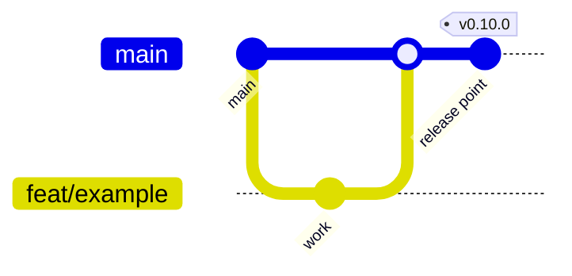
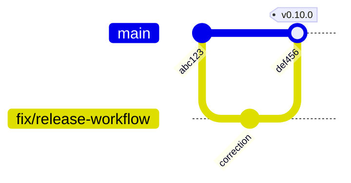

# Branching Strategy

**Main-based development with short-lived branches and immutable release
tags.** One long-lived branch, one pull-request target, and every release
identified by a tag that is never moved.

This document is the contract for where work happens. For how a release is
produced and verified, see the [Release Guide](../release-guide.md); for how to
run the gates locally, see [CONTRIBUTING.md](../../CONTRIBUTING.md).

## Core Principles

1. **`main` is the trunk.** Everything merges into it; every release tag
   points at a commit that is on it.
2. **Branches are short-lived and single-purpose.** Days, not weeks. A
   branch exists to carry one reviewable change to a pull request.
3. **Tags are immutable.** A published tag — release candidate or final — is
   never moved, deleted, re-pointed, or reused. A failed candidate stays as
   the record of what failed.
4. **A release is verified before it is tagged.** `make release` builds,
   signs and verifies `main`'s head, and the tag is created only after that
   passes. A failure leaves no tag, and the fix goes forward on `main`.
5. **A release candidate is optional, and a tag, not a branch.** When one is
   published, the final release is cut from the exact commit it was published
   from, whenever no correction was required.
6. **Maintenance branches are created on demand, never in advance.**

## Branch Model



A release whose verification fails is corrected on `main` and released again
under the **same** version, because no tag was created:



## Long-Lived Branches

### `main`

| Property | Value |
|---|---|
| Purpose | The trunk. The only branch every change reaches, and the only branch release tags are cut from. |
| Direct pushes | **No.** Every change arrives by pull request. |
| Required CI | `ci.yml` on pull request and on push (see [Protection and review](#protection-and-review)) |
| Merge policy | Squash merge (see [Merge Strategy](#merge-strategy)) |
| Release relationship | Every `vX.Y.Z-rc.N` and `vX.Y.Z` tag points at a commit on `main` |
| Protection | PR required, required status checks, no force push, no deletion |

`main` is the repository's default branch, the base of every pull request,
and — apart from any conditional maintenance branch below — the repository's
only branch. There is no second integration branch: see
[Why no permanent `develop`](#why-no-permanent-develop).

### `release/X.Y` — conditional, not standing

A maintenance branch exists **only** while an older release line still needs
patches and `main` has moved past it. See
[Maintenance Releases](#maintenance-releases). None is created in advance,
and one that has reached end of support is left in place as history rather
than being kept current.

## Short-Lived Branches

Every other branch is temporary, owned by one change, and deleted when its
pull request merges. Branch from the current `main`; rebase onto `main` if
it moves underneath you.

A branch should carry one reviewable change. If a branch needs a paragraph
to explain what it contains, it is probably two branches.

## Branch Naming

```text
<type>/<short-description>
```

Lowercase, hyphenated, no ticket-number-only names, no personal prefixes.

| Prefix | Use for |
|---|---|
| `feat/` | New capability or public API surface |
| `fix/` | Behavioral defect |
| `docs/` | Documentation only |
| `refactor/` | Internal change with no behavior change |
| `test/` | Tests, fixtures, benchmarks |
| `ci/` | Workflows and repository automation |
| `build/` | Build, packaging, Dockerfile, module wiring |
| `chore/` | Dependencies, housekeeping |
| `security/` | Hardening and vulnerability fixes (see [Security Fixes](#security-fixes)) |

Examples:

```text
feat/webhook-alert-routing
fix/postgres-readiness-after-reconnect
docs/operations-backup-restore
ci/validate-action-references
security/webhook-signature-validation
```

## Pull Request Flow

```text
issue or task
   ↓
branch from main:  feat/<description>
   ↓
implement + run the local gates (CONTRIBUTING.md)
   ↓
push branch
   ↓
open a pull request against main        ← always main; there is no other target
   ↓
CI runs the full gate set
   ↓
review by a human — maintainer or Organization Admin
   ↓
approval + conversations resolved
   ↓
squash merge by a human Organization Admin
   ↓
delete the branch
```

**Every pull request targets `main`.** That is the whole rule, and it is
what makes the project approachable to a first-time contributor.

Keep pull requests small enough to review in one sitting. Unrelated changes
belong in separate pull requests, because the unit that gets reverted,
bisected, and cited in a changelog is the merge.

## Merge Strategy

**Squash merge is the default.** One pull request becomes one commit on
`main`, which keeps the trunk bisectable, makes a revert a single operation,
and keeps work-in-progress commits out of the permanent history.

Exceptions, both rare:

- **Merge commit** when a series of commits is individually meaningful and
  worth preserving — a migration whose steps must stay separable, for
  example.
- **Rebase merge** is not used; it produces the same history as squash for
  single-commit branches and loses the pull-request association for longer
  ones.

Published history is never rewritten. A mistake on `main` is corrected by a
follow-up commit, not by a force push.

### Commit messages

A pull request is squash-merged, so its title becomes the commit subject on
`main`, and CI validates that title. The format, types, and scopes are in
[Commit Convention](../COMMIT_CONVENTION.md).

## Releases

A release is `main`'s head at the moment `make release` runs. There is no
release branch, and nothing is frozen.

```text
main@<sha>  →  make release  →  preflight, gates, build, sign, verify
            →  a human Organization Admin tags vX.Y.Z at <sha>  →  publish
```

Nothing is tagged until verification has passed, so a failure burns no
number. The [Release Guide](../release-guide.md) covers the procedure, and
[Release Governance](releases.md) who may act at each step.

## Release Candidates

A candidate is optional. Use one to put a build in front of users before
calling it stable, not to test the pipeline: a dry run does that.

```text
main@<sha>  →  make release VERSION=vX.Y.Z-rc.N  →  published as a prerelease
```

A candidate is marked as a prerelease: it never becomes GitHub's "Latest
release", and it never moves the floating container tags. Only a stable
release does either.

**The invariant:** a stable release after a candidate is cut from *that same
commit*. `make release` releases `main`'s head, so `main` must not have moved.
If anything changed (source, workflow, dependency, documentation), the result
is a new candidate, not a promotion. A published candidate's tag stays where
it is, and candidate numbers only ever increase. Why that matters, and the
ruleset that enforces it, are in [Release Governance](releases.md).

## Hotfixes

While `main` still represents the released line — the common case — a
hotfix is an ordinary change that happens to be urgent:

```text
main (still the v0.9 line)
   ↓
fix/<the-defect>  →  PR  →  CI  →  main
   ↓
make release VERSION=v0.9.1   (verified before it is tagged)
```

Verification is not skipped for urgency. It runs inside `make release`, before
the tag exists, and costs nothing extra.

If `main` has already moved on to work that must not ship in a patch, the
fix goes to a maintenance branch instead.

## Maintenance Releases

A maintenance branch is created **only** when both are true:

1. an older release line still needs supported patches, and
2. `main` has advanced past it with changes that must not ship in that
   patch.

```text
release/0.9            created from the v0.9.0 tag, when needed
   ↓
fix/<defect>  →  PR targeting release/0.9  →  CI
   ↓
v0.9.2
```

`make release` does not cover this case yet. It releases `main`'s head, and
only a version newer than every existing tag. The first maintenance release
needs a preflight rule for its line
([ADR 0059](../adr/0059-releases-are-dispatched-verified-then-published.md#consequences)).

Rules:

- Fix on `main` first when the defect exists there, then cherry-pick to the
  maintenance branch — so the next minor release cannot regress a fix that
  an older line already carries.
- If the defect exists *only* on the older line, fix it on the maintenance
  branch and note why it does not apply to `main`.
- Never create maintenance branches speculatively. A branch per release, kept
  green forever, multiplies CI cost and drift for support nobody asked for.

Pre-`v1.0`, Trustvian supports the latest release line only, so no
maintenance branch is expected. See
[.github/SECURITY.md](../../.github/SECURITY.md).

## Security Fixes

A vulnerability must not be developed in a public branch: the branch name,
the diff, and the tests describe the exploit before a fix exists.

```text
private report (GitHub Security Advisory)
   ↓
private fork created from the advisory
   ↓
fix + tests reviewed there
   ↓
merged to main at disclosure time
   ↓
release (normal candidate → stable flow)
   ↓
advisory published with the fixed version
```

Ordinary hardening with no embargo — input validation, a dependency bump,
tightening a check — is normal work on a `security/` branch and needs none
of this.

Reporting and triage are covered by
[.github/SECURITY.md](../../.github/SECURITY.md).

## Semantic Versioning

```text
MAJOR   incompatible public API change
MINOR   backward-compatible capability
PATCH   backward-compatible fix
```

Release candidates are `vX.Y.Z-rc.N`, numbered from 1 and increasing within
a version.

### Pre-`v1.0` discipline

Trustvian is pre-`v1.0`, where SemVer permits breaking changes in a minor
release. That permission is not a license to break users:

- A breaking change to the public API (`event`, `alert`, `config`, and the
  root package) lands in a **minor** bump, never a patch.
- It is called out in `CHANGELOG.md` with the migration a consumer must
  perform.
- A patch release contains fixes only — no API change, no behavior change
  a consumer could be surprised by, no storage-schema change.
- The persisted-state contract is stricter than the API contract: any change
  to the stored `Baseline` shape bumps the storage schema version, whatever
  the release number does. See the
  [Operations guide](../operations.md#compatibility-matrix).

## Protection and review

`main` is protected by a repository ruleset: pull request required, the
`ci.yml` gate set required and strict, squash-only, linear history,
conversation resolution, one approving review, and no force push or deletion.

The reviewer may be any authorized maintainer. The final merge is reserved for
a human Organization Admin, who may be the same person who reviewed it.

The enforced values, the exact required check names, the bypass entry that
exists while the project has a single maintainer, and what GitHub can and
cannot enforce natively are all in
[Repository Governance](repository.md) — that document is canonical for
repository controls, and this one does not restate them.

Agents follow the same path as anyone else and hold no authority to merge,
bypass, or mutate tags; see [Agent Governance](agents.md).

Release tags are protected against creation, update, deletion, and
force-move — see [Release Governance](releases.md).

## Automation

Automated pull requests — dependency updates in particular — follow the same
path as human ones: a branch, a pull request into `main`, the full CI gate
set, and a maintainer merge. A bot never gets a route around the checks that
gate a release, because a dependency bump is exactly the kind of change that
can break a build or introduce a vulnerability.

Use `chore/` for dependency branches when creating them by hand.

## Anti-Patterns

- **A long-lived integration branch beside `main`.** It doubles CI, drifts,
  and forces periodic sync merges that review nothing.
- **Long-lived feature branches.** Merge conflicts grow with age, and the
  review at the end is too large to be real.
- **Direct pushes to `main`**, including by maintainers.
- **Force pushes to a protected branch**, or any rewrite of published
  history.
- **Moving, deleting, or reusing a release tag** — especially a published
  candidate's.
- **Tagging by hand, outside `make release`.** A hand-pushed tag starts
  nothing, skips verification, and makes `make release` refuse that version.
- **A release branch with no maintenance need**, or a maintenance branch per
  version created in advance.
- **Mixing unrelated changes in one pull request**, which makes the merge
  unrevertable in practice.
- **Committing generated release artifacts** (`dist/`, SBOMs, images);
  releases carry them, the repository does not.

## Why This Model

**Why main-based with short-lived branches?** Releases are already defined by
tags and produced by a workflow that re-runs every gate against the released
commit and verifies the result before the tag exists, so nothing about producing a release needs a branch to stage it. What
the project does need — a trunk that is always releasable, small reviewable
changes, and one obvious target for outside contributors — is what this model
provides.

**Why not GitFlow?** Its `develop`, `release/*`, and `hotfix/*` branches exist
to stabilize a release while new work continues and to support many parallel
released versions. Trustvian stabilizes by verifying the trunk's head before
tagging it, and supports one release line, so GitFlow would add three branch classes and a
merge matrix for problems the project does not have.

**Why no permanent `develop`?** <a id="why-no-permanent-develop"></a>
It provided no release isolation. Every change accumulated on `develop` and
reached `main` as one wholesale pull request at release time, so the review
unit was "everything since the last release" — the opposite of a small
reviewable change — while individual changes reached `develop` with no pull
request at all. It also required periodic `main` → `develop` sync merges
purely to undo drift the split created, and left contributors two plausible
targets. Pull-request validation plus verify-before-tag releases give the
isolation `develop` was meant to provide, at one branch instead of two.

**When do maintenance branches become justified?** When Trustvian commits to
patching a release line that `main` has moved past — for example supporting
`1.0` while `main` works toward `1.1`. Until that commitment exists, the
branch is pure overhead.

## Related

- [Repository Governance](repository.md) — the enforced GitHub configuration
- [Release Governance](releases.md) — release and tag authority
- [Agent Governance](agents.md) — what AI agents may and may not do
- [Commit Convention](../COMMIT_CONVENTION.md) — commit and pull request titles
- [Release Guide](../release-guide.md) — producing and verifying a release
- [CONTRIBUTING.md](../../CONTRIBUTING.md) — the local gates and module layout
- [Operations](../operations.md) — upgrade and compatibility contracts
